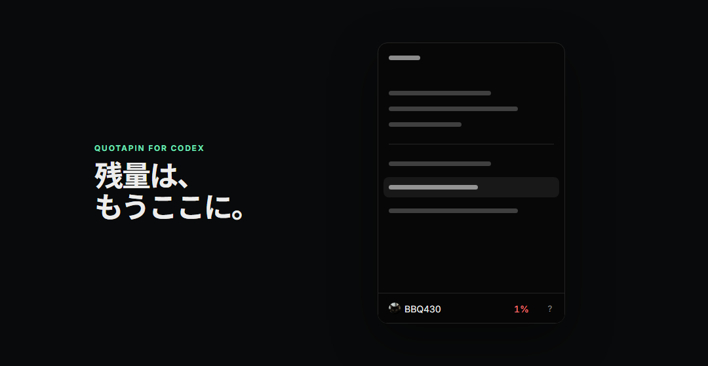
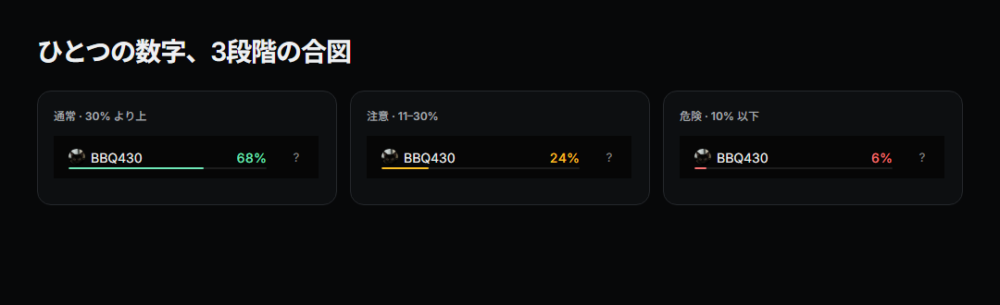
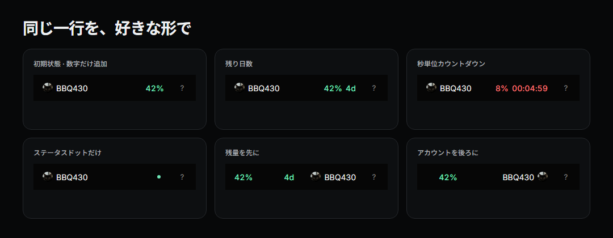

<h1 align="center">QuotaPin for Codex</h1>

<p align="center">
  <strong>メニューを開かなくても、Codex の残量が見える。</strong><br>
  残り使用量やリセット情報を、いつもの Codex アカウント欄に追加するローカル動作のオープンソースツールです。
</p>

<p align="center">
  <a href="README.md">English</a> · <a href="README.zh-CN.md">简体中文</a> · <a href="README.ja.md">日本語</a>
</p>

<p align="center">
  
  
  
  
  <a href="https://github.com/WSL043/QuotaPin-for-Codex/releases/latest"></a>
  <a href="https://github.com/WSL043/QuotaPin-for-Codex/actions/workflows/check.yml"></a>
</p>

<p align="center">
  
</p>

<p align="center">
  <a href="https://github.com/WSL043/QuotaPin-for-Codex/releases/latest"><strong>最新の安定版をダウンロード</strong></a>
  · <a href="SECURITY.md">セキュリティ</a>
  · <a href="PRIVACY.md">プライバシー</a>
  · <a href="docs/architecture.md">アーキテクチャ</a>
  · <a href="docs/configuration.md">設定</a>
</p>

> [!IMPORTANT]
> QuotaPin は非公式のコミュニティプロジェクトです。OpenAI との提携、承認、サポート関係はありません。

## QuotaPin を作った理由

Codex 自体は利用枠を把握しています。面倒なのは、残量を確認するたびにアカウントメニューを開く必要があることです。

QuotaPin は、その「見たい情報」だけをアカウント欄に残します。確認のための操作を、ただの一目確認に変えるのが目的です。

- **初期状態は最小限。** インストール直後は残りのパーセントだけを追加します。
- **元の操作を邪魔しません。** 短押しは通常の Codex メニュー、長押しだけが QuotaPin です。
- **必要なときだけ細かく調整。** リセット時刻、カウントダウン、状態色、Token 統計、レイアウトを組み合わせられます。
- **ローカル優先。** 製品テレメトリやアカウント DB はなく、Codex 公式パッケージも変更しません。
- **曖昧なら何もしない。** アカウント欄を一意に特定できない場合は、誤った場所に表示せず何も描画しません。

## 対応状況

最新安定版：**v1.2.1**。

| プラットフォーム | 現在の状態 |
|---|---|
| Windows 11 x64 | ✅ 安定 / サインイン済み実機で確認済み |
| Windows 10 x64（2004 以降） | ⚠️ ベストエフォート |
| Windows ARM64 | ❌ 未対応 |
| macOS 13 以降 · Apple シリコン / Intel | 🧪 公開パッケージ / CI 検証済み。サインイン済み実機での受け入れ確認は未完了 |

## インストール

### 推奨：通常のインストーラー

**[最新の安定版 Release](https://github.com/WSL043/QuotaPin-for-Codex/releases/latest)** を開きます。

- **Windows：** バージョン付きの `.exe` を実行します。
- **macOS：** Universal `.dmg` を開き、**QuotaPin Installer** をダブルクリックします。

インストールはユーザー単位です。Windows では管理者権限、macOS では `sudo`、Homebrew、追加ランタイムはいりません。インストールや更新で実行中の Codex を終了・再起動することもありません。安全に接続できない場合は、次回の通常起動を待ちます。

> [!NOTE]
> **Windows 版 QuotaPin 1.1.2 以前から更新する場合：**インストーラー、または下記の 1 コマンドを一度実行してください。旧版は更新プロセスが始まる前に起動に失敗することがあり、自分自身の更新機構を確実に修復できません。この一度だけの修復では設定が保持され、実行中の Codex も終了しません。1.2.1 以降は QuotaPin 内からの更新が再びサポートされます。

### 1 コマンドでインストール

コマンドラインを使いたい場合、ブートストラップも公開されています。実行前に内容を確認できます：[`install.ps1`](install.ps1) · [`install-macos.sh`](install-macos.sh)。

**Windows — PowerShell**

```powershell
irm https://raw.githubusercontent.com/WSL043/QuotaPin-for-Codex/main/install.ps1 | iex
```

**macOS — ターミナル**

```bash
curl -fsSL https://raw.githubusercontent.com/WSL043/QuotaPin-for-Codex/main/install-macos.sh | bash
```

ブートストラップは公開済みの immutable GitHub Release を解決し、GitHub SHA-256 ダイジェストとパッケージ識別情報を確認してから、現在のユーザー向けにインストールします。ブートストラップ自体にも不変性が必要な脅威モデルでは、raw URL の `main` を明示的な Release tag に固定してください。バージョン指定とロールバック例は[設定ガイド](docs/configuration.md#updates-and-recovery-versions)にあります。

Windows では、どちらも同じプラットフォーム用パッケージを使います。コマンド版はトレイアイコンのない静かな watcher 構成、案内付き EXE はトレイ機能を有効にします。

<details>
<summary>Windows で、取得済みのリポジトリからインストールする</summary>

```powershell
powershell.exe -NoProfile -ExecutionPolicy Bypass -File .\install.ps1
```

通常の PowerShell 実行ポリシーが `Restricted` の場合でも利用できます。

</details>

## 普段は一目、必要なら細かく

初期状態では Codex 標準のアバターとアカウント名を残し、残りのパーセントだけを追加します。

<p align="center">
  
  <br><sub>初期値は 30% で注意、10% で危険。どちらのしきい値も変更できます。</sub>
</p>

<p align="center">
  
</p>

次の項目は、それぞれ個別に表示・非表示・並べ替えできます。

- 残りパーセント
- ステータスドットと、残量表示に合わせる／アカウント欄いっぱいに広げる残量ライン
- 残り時間と秒単位カウントダウン
- リセット日とリセット時刻
- この端末の本日分 Token 合計
- 確定済みのアカウント累計 Token 合計

コンパクト表示（`4d 8h`）はすべての UI 言語で共通です。別の文章形式モジュールは選択中の言語に合わせて `4 days 8 hours`、`4天8小时`、`4日8時間` と表示します。ホバーでは正確な値を確認でき、本日分など端末単位の値はその範囲も明示します。

よく使う組み合わせは名前付きビューとして保存し、すぐ切り替えられます。

## Codex のアカウントメニューはそのまま

短押しなら、今まで通り Codex のアカウントメニューが開きます。同じ行を長押ししたときだけ QuotaPin が開きます。もう一度押すかパネル外をクリックすると閉じます。ヘルプボタン、アバター、アカウント名、通常メニューはそのままです。

<p align="center">
  
  <br><sub>左・右・中央へドラッグすると、周囲の項目が自然に場所を空けます。</sub>
</p>

- **かんたん：** 利用枠の期間、表示項目、並びを選びます。
- **カスタマイズ：** 色、しきい値、ホバー内容、アバター形状、明暗、動きを調整します。
- **コード：** 検証済みの設定項目をすべて扱えます。崩れてもリセットできます。

## ローカル動作。ただし CDP の境界は隠しません

QuotaPin は Chromium DevTools Protocol（CDP）を使って Codex Desktop に接続します。CDP エンドポイントは `127.0.0.1` のランダムなポートにバインドされます。

**CDP は強い権限を持つレンダラー制御インターフェースです。** 接続したソフトウェアは原理上レンダラー内容を確認・変更できます。つまり、ここは本物の信頼境界です。「ローカルだから安全」とだけ言って済ませるつもりはありません。この境界を受け入れられない脅威モデルでは、QuotaPin を実行しないでください。

実装では、露出を次のように抑えています。

- CDP はループバックだけにバインドし、起動ごとに新しい一時ポートを使う
- Codex の正確なメインページ URL にだけ接続する
- 利用枠 App Server は `stdio` のまま扱う
- Windows では Authenticode 署名から OpenAI を発行者として確認できる Codex コマンドだけを受け入れる
- Token、Cookie、プロンプト、ページ内容をログに残さない
- QuotaPin の製品テレメトリを送信しない
- Codex 公式パッケージを変更しない
- Codex エンドポイントが閉じたら Agent も終了する

同じ OS ユーザー権限ですでに動作しているマルウェアからの防御までは主張していません。完全な脅威モデル、Release の整合性チェック、SBOM / artifact attestation、脆弱性報告手順は **[SECURITY.md](SECURITY.md)** に、データの扱いは **[PRIVACY.md](PRIVACY.md)** にまとめています。

## 更新と互換性

確認に成功した後の自動チェックは6時間に1回までです。一時的な通信失敗では前回確認済みの結果を残し、15分後から再試行します。確認なしにインストールせず、Codex を再起動することもありません。修復や更新後も保存済みのビューと設定は維持されます。

Codex の UI は今後も変わり得ます。QuotaPin はアカウント欄を一意に特定できない場合、推測して描画せず、そのまま何も表示しません。確認済みの互換性と復旧方法は[互換性](docs/compatibility.md)と[設定](docs/configuration.md)を参照してください。

## macOS の現在地

Universal DMG には Apple シリコン版と Intel 版が含まれます。GitHub Actions では macOS 15 と macOS 26 のネイティブ runner を使い、最終イメージのインストール、LaunchAgent 設定の検証、更新、設定保持、アンインストールまで確認しています。公式署名済み Codex ランタイム経由の起動は、実機受け入れ確認の対象です。

一方で CI では、現在の Codex にサインインした状態での実際のアカウント欄と、ユーザー環境での Gatekeeper の挙動までは証明できません。この実機受け入れ確認はまだ残っています。詳しくは [macOS の実装と受け入れ境界](docs/macos.md)を参照するか、匿名化した[互換性レポート](https://github.com/WSL043/QuotaPin-for-Codex/issues/new?template=macos-compatibility.yml)を送ってください。

## アイデア、バグ、コントリビューション

- バグを見つけた場合：再現手順と環境情報を添えて Issue を作成してください。
- アイデアがある場合：[既存の要望を検索](https://github.com/WSL043/QuotaPin-for-Codex/issues?q=is%3Aissue+is%3Aopen+label%3Aenhancement+sort%3Areactions-%2B1-desc)し、同じ案には 👍 を。なければ[機能リクエスト](https://github.com/WSL043/QuotaPin-for-Codex/issues/new?template=feature.yml)を送れます。
- コードを送る場合：[CONTRIBUTING.md](CONTRIBUTING.md)を先に確認してください。
- セキュリティ問題：[SECURITY.md](SECURITY.md)に記載した GitHub の非公開脆弱性報告フローを使ってください。

## アンインストール

**Windows**

**スタート > QuotaPin > Uninstall QuotaPin** を開くか、次を実行します。

```powershell
& "$env:LOCALAPPDATA\QuotaPin\unins000.exe"
```

**macOS**

```bash
"$HOME/Library/Application Support/QuotaPin/uninstall.sh"
```

削除するのは QuotaPin 自身のファイルとショートカットだけです。Codex はそのまま残ります。

## ライセンス

QuotaPin は [MIT License](LICENSE) で公開しています。
