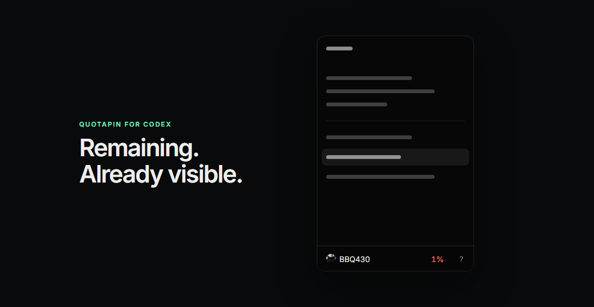
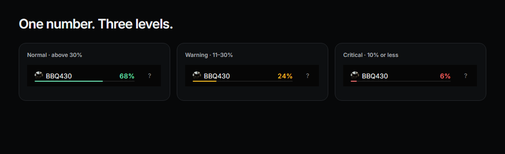
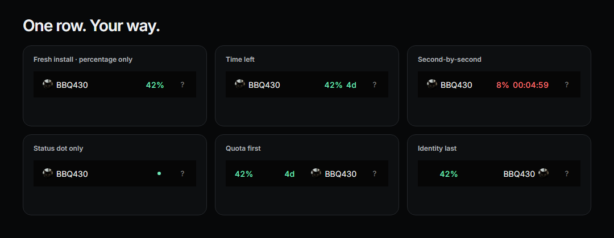
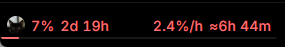

<h1 align="center">QuotaPin for Codex</h1>

<p align="center">
  <strong>Your Codex quota, visible before you open the menu.</strong><br>
  A local, open-source companion that adds remaining usage and reset information to the existing Codex account row.
</p>

<p align="center">
  <a href="README.md">English</a> · <a href="README.zh-CN.md">简体中文</a> · <a href="README.ja.md">日本語</a>
</p>

<p align="center">
  
  
  
  
  <a href="https://github.com/WSL043/QuotaPin-for-Codex/releases/latest"></a>
  <a href="https://github.com/WSL043/QuotaPin-for-Codex/actions/workflows/check.yml"></a>
</p>

<p align="center">
  
</p>

<p align="center">
  <a href="https://github.com/WSL043/QuotaPin-for-Codex/releases/latest"><strong>Download the latest release</strong></a>
  · <a href="SECURITY.md">Security</a>
  · <a href="PRIVACY.md">Privacy</a>
  · <a href="docs/architecture.md">Architecture</a>
  · <a href="docs/configuration.md">Configuration</a>
</p>

> [!IMPORTANT]
> QuotaPin is an unofficial community project. It is not affiliated with, endorsed by, or supported by OpenAI.

## Why QuotaPin

Codex already knows your usage limit. The annoying part is having to open the account menu whenever you want to check it.

QuotaPin keeps the useful part visible in the account row, so checking quota becomes a glance instead of an interruption.

- **Glanceable by default.** A fresh install adds only the remaining percentage.
- **Native-feeling interaction.** Short-click the row for the normal Codex menu; hold it for QuotaPin.
- **Configurable when you want it.** Add reset time, countdowns, burn pace, estimated runway, status colors, token totals, and custom layouts.
- **Local-first.** No product telemetry, no account database, and no patching of the official Codex package.
- **Fail closed.** If QuotaPin cannot identify one unambiguous account row, it renders nothing rather than guessing.

## Platform status

Latest stable: **v1.3.1**.

| Platform | Status |
|---|---|
| Windows 11 x64 | ✅ Stable / verified on a signed-in machine |
| Windows 10 x64 (2004+) | ⚠️ Supported baseline; real-device reports still welcome |
| Windows 11 ARM64 | ✅ x64 package verified under native ARM64 CI emulation |
| Windows 10 ARM64 | ❌ Not supported; Windows 10 cannot emulate x64 apps on ARM64 |
| macOS 13+ · Apple silicon / Intel | 🧪 Public package / CI validated; signed-in real-Mac acceptance still pending |

## Install

### Recommended: normal installer

Open the **[latest stable release](https://github.com/WSL043/QuotaPin-for-Codex/releases/latest)**.

- **Windows:** run the versioned `.exe` installer.
- **macOS:** open the universal `.dmg`, then double-click **QuotaPin Installer**.

Installation is per-user. Windows does not require elevation; macOS does not require `sudo`, Homebrew, or a separate runtime. Installing or updating never closes or restarts a running Codex session. If QuotaPin cannot attach safely, it waits for the next normal Codex launch.

> [!NOTE]
> **Upgrading from QuotaPin 1.1.2 or earlier on Windows:** run the installer or Quick Start once. The updater in those builds can fail before the update process starts, so it cannot reliably install its own fix. This one-time repair keeps your settings and leaves the running Codex session open. Updates started from QuotaPin are supported again from 1.2.1 onward.

### Command-line install

If you prefer a one-command bootstrap, the scripts are public and can be inspected first: [`install.ps1`](install.ps1) · [`install-macos.sh`](install-macos.sh).

**Windows — PowerShell**

```powershell
irm https://raw.githubusercontent.com/WSL043/QuotaPin-for-Codex/main/install.ps1 | iex
```

**macOS — Terminal**

```bash
curl -fsSL https://raw.githubusercontent.com/WSL043/QuotaPin-for-Codex/main/install-macos.sh | bash
```

The bootstrap resolves a published immutable GitHub Release, verifies the GitHub SHA-256 digest and package identity, then installs the platform package for the current user. If your threat model requires the bootstrap itself to be immutable too, pin its raw URL to an exact release tag instead of `main`. Version selection and rollback examples are in [configuration](docs/configuration.md#updates-and-recovery-versions).

On Windows, the command install uses the quiet watcher without a tray icon. The guided EXE installer enables the tray companion. Both use the same platform package.

<details>
<summary>Installing from an existing clone on Windows</summary>

```powershell
powershell.exe -NoProfile -ExecutionPolicy Bypass -File .\install.ps1
```

This also works when the normal PowerShell execution policy is `Restricted`.

</details>

## One glance, as much detail as you want

The default keeps the original Codex avatar and account name and adds only the remaining percentage.

<p align="center">
  
  <br><sub>Default thresholds are 30% for warning and 10% for critical; both are editable.</sub>
</p>

<p align="center">
  
</p>

<p align="center">
  
  <br><sub>Optional pace and runway modules, kept in the same account row.</sub>
</p>

You can independently show, hide, and reorder:

- remaining percentage;
- recent account-wide burn pace and estimated runway;
- status dot and a quota line that can follow the quota modules or span the account row;
- time left and second-by-second countdown;
- reset date and reset time;
- today's token total from this device;
- settled account lifetime token total.

Pace and runway are opt-in estimates derived only from changes in the official remaining percentage; QuotaPin waits for enough history before showing them. Compact time (`4d 8h`) works in every UI language. A separate worded module follows the selected language (`4 days 8 hours`, `4天8小时`, or `4日8時間`). Hover details expose exact values and make device-local scope explicit where it matters.

Save useful combinations as named views and switch between them without rebuilding the row.

## Open QuotaPin without replacing the Codex menu

Short-click the account row and Codex behaves normally. Hold the same row to open QuotaPin. Press it again—or click outside—to close the open panel. The native help button, avatar, account name, and normal account menu stay in place.

<p align="center">
  
  <br><sub>Drag modules left, right, or into the center; neighboring items make room as you move.</sub>
</p>

- **Quick** chooses the usage window, visible modules, and layout.
- **Customize** controls colors, thresholds, hover text, avatar shape, appearance, and motion.
- **Code** exposes the validated configuration surface, with reset available if an experiment goes sideways.

## Local by design — with an explicit CDP boundary

QuotaPin integrates with Codex Desktop through a Chromium DevTools Protocol (CDP) endpoint bound to a random port on `127.0.0.1`.

**CDP is a powerful renderer-control interface.** Software attached through it can inspect or modify renderer content, so this is a real trust boundary, not something QuotaPin tries to hand-wave away. If that boundary is outside your threat model, do not run QuotaPin.

The implementation reduces exposure by:

- binding CDP to loopback only and choosing a new ephemeral port per launch;
- attaching only to the exact Codex main-page URL;
- keeping the rate-limit App Server on `stdio`;
- accepting the app-managed Codex command on Windows only when its Authenticode signature identifies OpenAI;
- not logging tokens, cookies, prompts, or page content;
- sending no QuotaPin product telemetry;
- never patching the official Codex package;
- terminating the Agent after the Codex endpoint closes.

QuotaPin does not claim to defend against malware already running as the same OS user. The full threat model, release integrity checks, SBOM/attestation details, and reporting process are documented in **[SECURITY.md](SECURITY.md)**. Data handling is documented separately in **[PRIVACY.md](PRIVACY.md)**.

## Updates and compatibility

QuotaPin checks after a successful result no more than once every six hours. A temporary network failure keeps the last verified result and retries sooner, beginning after 15 minutes. Nothing is installed without confirmation, Codex is never restarted, and saved views and preferences survive repair or update.

Codex can change its UI over time. QuotaPin deliberately refuses to render when it cannot identify the account row unambiguously. Observed compatibility and recovery options are documented in [compatibility](docs/compatibility.md) and [configuration](docs/configuration.md).

## macOS status

The universal DMG contains Apple silicon and Intel builds. GitHub Actions exercises the final image on native runners under macOS 15 and macOS 26, including install, staged LaunchAgent validation, update, configuration preservation, and uninstall paths. Launch through the signed official Codex runtime remains part of real-Mac acceptance.

What CI cannot prove is the current signed-in Codex account row and real Gatekeeper behavior on a user's Mac. That acceptance step is still open. See [the macOS implementation and acceptance boundary](docs/macos.md), or send a sanitized [compatibility report](https://github.com/WSL043/QuotaPin-for-Codex/issues/new?template=macos-compatibility.yml).

## Ideas, bugs, and contributions

- Found a bug? Open an issue with reproduction steps and environment details.
- Have an idea? [Search existing requests](https://github.com/WSL043/QuotaPin-for-Codex/issues?q=is%3Aissue+is%3Aopen+label%3Aenhancement+sort%3Areactions-%2B1-desc), vote with 👍, or [submit a feature request](https://github.com/WSL043/QuotaPin-for-Codex/issues/new?template=feature.yml).
- Want to send code? Read [CONTRIBUTING.md](CONTRIBUTING.md) first.
- Security issue? Use GitHub's private vulnerability reporting flow described in [SECURITY.md](SECURITY.md).

## Uninstall

**Windows**

Use **Start > QuotaPin > Uninstall QuotaPin**, or run:

```powershell
& "$env:LOCALAPPDATA\QuotaPin\unins000.exe"
```

**macOS**

```bash
"$HOME/Library/Application Support/QuotaPin/uninstall.sh"
```

QuotaPin removes its own files and shortcuts. Codex stays untouched.

## License

QuotaPin is released under the [MIT License](LICENSE).
