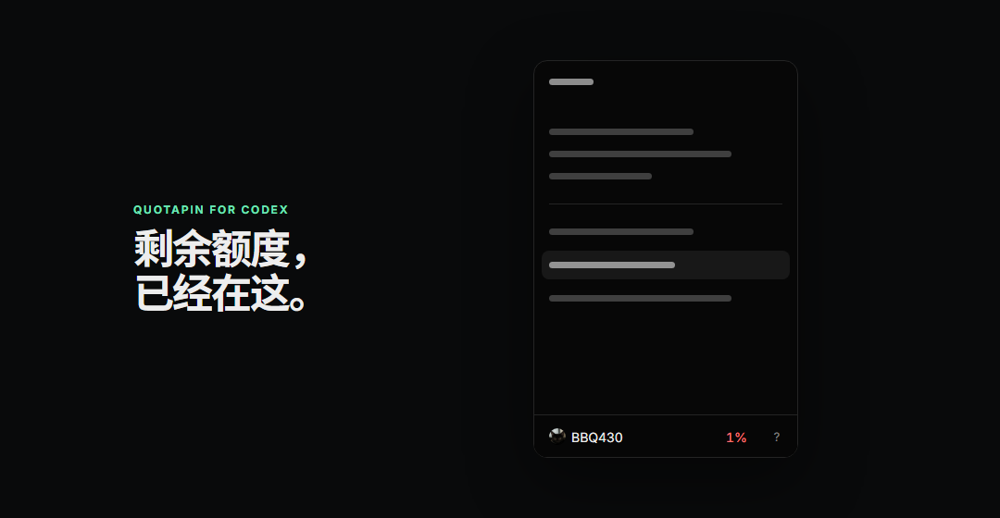
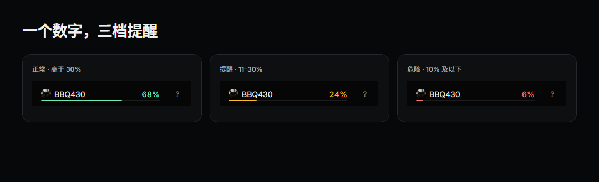
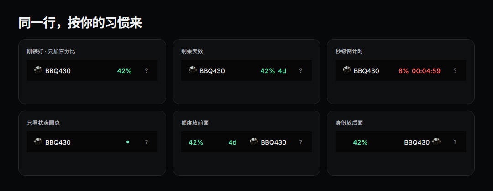
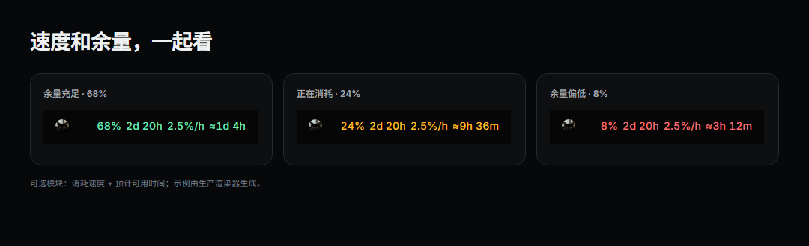
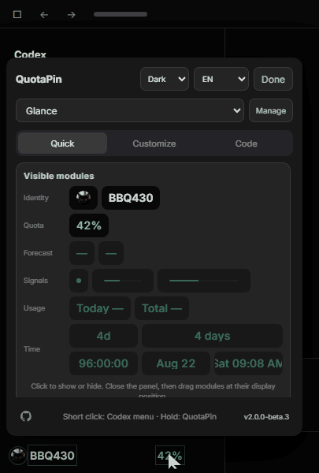

<h1 align="center">QuotaPin for Codex</h1>

<p align="center">
  <strong>不用打开菜单，也能随时看到 Codex 剩余额度。</strong><br>
  一个本地运行、开源的 Codex 桌面端伴侣，把剩余用量和重置信息直接放进原本的账户栏。
</p>

<p align="center">
  <a href="README.md">English</a> · <a href="README.zh-CN.md">简体中文</a> · <a href="README.ja.md">日本語</a>
</p>

<p align="center">
  
  
  
  
  <a href="https://github.com/WSL043/QuotaPin-for-Codex/releases/latest"></a>
  <a href="https://github.com/WSL043/QuotaPin-for-Codex/actions/workflows/check.yml"></a>
</p>

<p align="center">
  
</p>

<p align="center">
  <a href="https://github.com/WSL043/QuotaPin-for-Codex/releases/latest"><strong>下载最新稳定版</strong></a>
  · <a href="SECURITY.md">安全</a>
  · <a href="PRIVACY.md">隐私</a>
  · <a href="docs/architecture.md">架构</a>
  · <a href="docs/configuration.md">配置</a>
</p>

> [!IMPORTANT]
> QuotaPin 是非官方社区项目，与 OpenAI 没有隶属、认可或支持关系。

## 为什么做 QuotaPin

Codex 本来就知道你的使用额度。麻烦的是，每次想看还剩多少，都得先打开账户菜单。

QuotaPin 做的事情很简单：把真正有用的信息留在账户栏里。看额度从一次操作，变成扫一眼。

- **默认就够用。** 刚安装时只多一个剩余百分比，不把界面塞满。
- **不抢原来的交互。** 短按账户栏照常打开 Codex 菜单，长按才打开 QuotaPin。
- **需要时再折腾。** 重置时间、倒计时、消耗速度、预计可用时间、状态颜色、Token 统计和布局都可以自己组合。
- **本地优先。** 不做产品遥测，不维护账户数据库，也不修改官方 Codex 安装包。
- **宁可不显示，也不猜。** 无法唯一确认账户栏时，QuotaPin 会保持隐藏。

## 平台状态

当前稳定版：**v1.3.1**。

| 平台 | 当前状态 |
|---|---|
| Windows 11 x64 | ✅ 稳定 / 已在登录状态实机验证 |
| Windows 10 x64（2004+） | ⚠️ 支持基线；仍欢迎真实设备反馈 |
| Windows 11 ARM64 | ✅ x64 安装包已通过原生 ARM64 CI 仿真验收 |
| Windows 10 ARM64 | ❌ 不支持；Windows 10 ARM64 无法模拟 x64 应用 |
| macOS 13+ · Apple 芯片 / Intel | 🧪 已公开安装包 / CI 已验证；仍等待登录状态 Mac 实机验收 |

## 安装

### 推荐：普通安装器

打开 **[最新稳定版 Release](https://github.com/WSL043/QuotaPin-for-Codex/releases/latest)**。

- **Windows：** 运行带版本号的 `.exe`。
- **macOS：** 打开通用 `.dmg`，再双击 **QuotaPin Installer**。

安装只作用于当前用户。Windows 不需要管理员权限；macOS 不需要 `sudo`、Homebrew 或额外运行环境。安装和更新都不会关闭或重启正在运行的 Codex；当前进程无法安全接入时，QuotaPin 会等到下次正常启动。

> [!NOTE]
> **Windows 上从 QuotaPin 1.1.2 或更早版本升级：**请用安装器或下方的一条命令执行一次修复。旧版的更新器可能在更新进程真正启动前失败，因此无法稳定地给自己装上这次修复。这个一次性操作会保留配置，也不会关闭正在运行的 Codex。升级到 1.2.1 后，面板内更新恢复为受支持路径。

### 一条命令安装

如果更习惯命令行，引导脚本本身也是公开的，可以先看再运行：[`install.ps1`](install.ps1) · [`install-macos.sh`](install-macos.sh)。

**Windows — PowerShell**

```powershell
irm https://raw.githubusercontent.com/WSL043/QuotaPin-for-Codex/main/install.ps1 | iex
```

**macOS — 终端**

```bash
curl -fsSL https://raw.githubusercontent.com/WSL043/QuotaPin-for-Codex/main/install-macos.sh | bash
```

引导脚本会解析已经发布且不可变的 GitHub Release，校验 GitHub SHA-256 摘要与安装包身份，再为当前用户安装对应平台包。如果你的威胁模型要求“引导脚本本身”也不可变，请把 raw URL 从 `main` 固定到明确的 Release tag。指定版本和回退示例见[配置文档](docs/configuration.md#updates-and-recovery-versions)。

Windows 下，两种安装方式使用的是同一份平台包。命令行安装采用没有托盘图标的安静 watcher；带界面的 EXE 安装器会启用托盘伴侣。

<details>
<summary>已经拉取仓库时，在 Windows 本地安装</summary>

```powershell
powershell.exe -NoProfile -ExecutionPolicy Bypass -File .\install.ps1
```

即使常规 PowerShell 执行策略为 `Restricted`，也可以使用这条命令。

</details>

## 平时只看一眼，想看多少细节都可以

默认状态保留 Codex 原来的头像和账户名，只增加剩余百分比。

<p align="center">
  
  <br><sub>默认 30% 进入提醒、10% 进入危险；两个阈值都可以修改。</sub>
</p>

<p align="center">
  
</p>

<p align="center">
  
  <br><sub>可选的预测模块，使用与实际账户栏相同的生产渲染器生成。</sub>
</p>

下面这些模块都可以单独显示、隐藏和排序：

- 剩余百分比；
- 账户近期消耗速度和预计可用时间；
- 状态圆点，以及跟随额度模块或横跨账户栏的额度线；
- 剩余时间和秒级倒计时；
- 重置日期和重置时间；
- 这台电脑今天的 Token 总量；
- 已结算的账户累计 Token 总量。

消耗速度和预计可用时间默认关闭，只根据官方剩余百分比的变化估算；样本不足时不会硬猜。紧凑时间（`4d 8h`）三种界面语言通用；另一套文字模块会跟随当前语言显示为 `4 days 8 hours`、`4天8小时` 或 `4日8時間`。悬浮信息会显示精确数值，并在需要时明确标注“仅统计本机”。

常用组合可以保存成命名视图，不用每次重新排。

## 不替换 Codex 原来的账户菜单

短按账户栏，一切和原来的 Codex 一样；长按同一行才会打开 QuotaPin。再次按下或点击面板外即可关闭。原有帮助按钮、头像、账户名和账户菜单都保留。

<p align="center">
  
  <br><sub>拖到左侧、右侧或中间，旁边的项目会自动让位。</sub>
</p>

- **快速：** 选择额度周期、显示模块和排列方式。
- **自定义：** 调整颜色、阈值、悬浮内容、头像形状、明暗和动态效果。
- **代码：** 暴露经过校验的完整配置面；折腾乱了也可以重置。

## 本地运行，但把 CDP 风险边界说清楚

QuotaPin 通过 Chromium DevTools Protocol（CDP）接入 Codex Desktop，CDP 端点绑定在 `127.0.0.1` 的随机端口上。

**CDP 本身是一个权限很高的渲染器控制接口。** 连接到它的软件理论上能够检查或修改渲染内容，所以这是真实存在的信任边界，不应该用一句“本地运行”就糊弄过去。如果你的威胁模型不能接受这一点，就不要运行 QuotaPin。

当前实现通过下面这些措施缩小暴露面：

- CDP 只绑定回环地址，每次启动使用新的临时端口；
- 只连接精确匹配的 Codex 主页面 URL；
- 限额 App Server 保持在 `stdio`；
- Windows 下只有 Authenticode 签名能够确认发布者为 OpenAI 的 Codex 命令才会被接受；
- 不记录 Token、Cookie、提示词或页面内容；
- 不发送 QuotaPin 产品遥测；
- 从不修改官方 Codex 安装包；
- Codex 端点关闭后，Agent 随之结束。

QuotaPin 不声称能够防御已经以同一系统用户身份运行的恶意软件。完整威胁模型、Release 完整性校验、SBOM / artifact attestation 和漏洞报告流程都写在 **[SECURITY.md](SECURITY.md)**；数据处理单独写在 **[PRIVACY.md](PRIVACY.md)**。

## 更新与兼容性

一次成功检查后，QuotaPin 最多每六小时再检查一次；临时网络故障不会抹掉上次确认的结果，并会从 15 分钟后开始重试。未经确认不会安装，更新不会重启 Codex，修复或升级也会保留已保存的视图和偏好。

Codex 的界面本身会继续变化。QuotaPin 在无法明确识别账户栏时会拒绝渲染，而不是猜位置硬塞进去。当前实测兼容性和恢复方案见[兼容性](docs/compatibility.md)与[配置](docs/configuration.md)。

## macOS 当前状态

通用 DMG 同时包含 Apple 芯片与 Intel 构建。GitHub Actions 已在 macOS 15 与 macOS 26 的原生 runner 上对最终镜像执行安装、LaunchAgent 配置校验、更新、配置保留和卸载测试；通过官方签名 Codex 运行时启动仍需真机验收。

CI 仍然无法替代两件事：当前 Codex 在登录状态下的真实账户栏，以及用户 Mac 上真实的 Gatekeeper 行为。这一步实机验收还没有完成。详细边界见 [macOS 说明](docs/macos.md)，也欢迎提交[脱敏兼容性报告](https://github.com/WSL043/QuotaPin-for-Codex/issues/new?template=macos-compatibility.yml)。

## 想法、问题与贡献

- 遇到 Bug：提交 Issue，并尽量附上复现步骤和环境信息。
- 有想法：先[搜索已有需求](https://github.com/WSL043/QuotaPin-for-Codex/issues?q=is%3Aissue+is%3Aopen+label%3Aenhancement+sort%3Areactions-%2B1-desc)，相同需求用 👍 投票；没有再[提交新功能建议](https://github.com/WSL043/QuotaPin-for-Codex/issues/new?template=feature.yml)。
- 想提交代码：先看 [CONTRIBUTING.md](CONTRIBUTING.md)。
- 安全问题：请按 [SECURITY.md](SECURITY.md) 使用 GitHub 的私密漏洞报告流程。

## 卸载

**Windows**

打开 **开始菜单 > QuotaPin > Uninstall QuotaPin**，或者运行：

```powershell
& "$env:LOCALAPPDATA\QuotaPin\unins000.exe"
```

**macOS**

```bash
"$HOME/Library/Application Support/QuotaPin/uninstall.sh"
```

QuotaPin 只移除自己的文件和快捷方式，不会动 Codex。

## 许可证

QuotaPin 使用 [MIT License](LICENSE) 开源。
